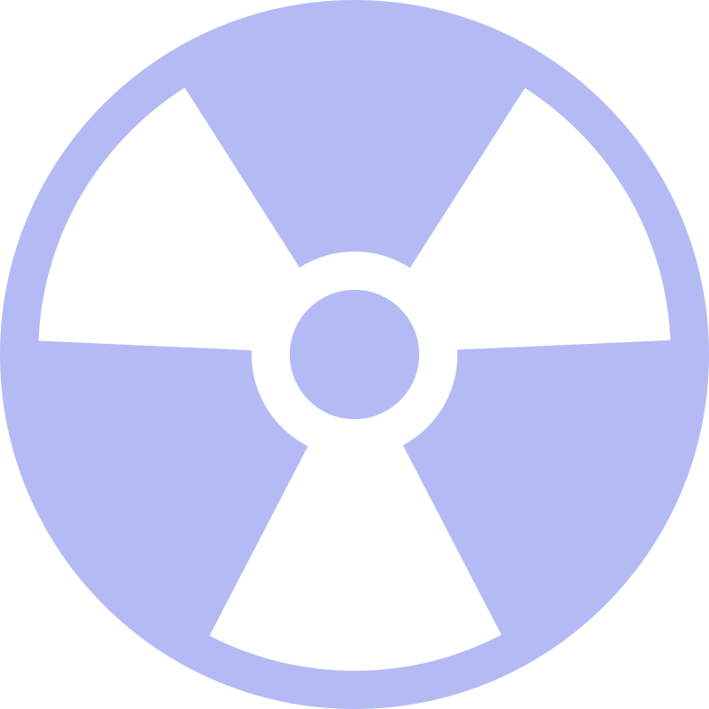

# NukeShip


[](https://app.koyeb.com/deploy?name=nukeship&repository=Passeriform%2FNukeShip&branch=master&instance_type=free)

<div align="center">
  
</div>

&nbsp;&nbsp;&nbsp;&nbsp;

NukeShip is a cyberpunk twist on the classic game of Battleship. Engage in a high-stakes battle to destroy your opponent's ships by strategically targeting their weak points.

## How to Play

1. Launch the game and connect with an opponent.
2. Strategically target your opponent's ships and destroy them.
3. First player to destroy the opponent's ships wins!

## Features

- **Cross-Platform Support:** Run the game seamlessly on multiple platforms.

## Download Latest Release (1.0)

To download the latest pre-built binary, visit the [Releases](https://github.com/Passeriform/NukeShip/releases) page on GitHub and select the version compatible with your system.

## Getting Started

### Prerequisites

Ensure you have the following installed on your system:

- [Go](https://go.dev/doc/install)
- [Node.js](https://nodejs.org/en/download)
- [Protoc](https://grpc.io/docs/protoc-installation/)

### Build Source

1. Clone the repository:

    ```bash
    git clone https://github.com/Passeriform/NukeShip.git
    cd NukeShip
    ```

2. Install Wails:

    ```bash
    go install github.com/wailsapp/wails/v2/cmd/wails@latest
    ```

3. Generate protobuf bindings:

    ```bash
    cd ./internal/pb
    protoc --go_out=. --go_opt=paths=source_relative --go-grpc_out=. --go-grpc_opt=paths=source_relative --proto_path=. ./*.proto
    ```

4. Build the project:

    ```bash
    wails build -clean
    ```

5. Run the game:

    ```bash
    ./build/bin/NukeShip
    ```

## VSCode Support

This project uses VSCode tooling. Supporting tasks, debugger configurations and editor settings are provided to ease the development:

### Tasks

- `[Protobuf] Refresh`
- `[App] Build Client`
- `[App] Run Client`
- `[Server] [Local] Run Server`
- `[Server] [Docker] Run Server`
- `[Cli] [Local] Run Native Client - Create Room`
- `[Cli] [Local] Run Native Client - Join Room`

### Debugging Configurations

- `Run Server`
- `Run App Client`
- `Run Native Client`

## Contributing

Contributions are welcome! To contribute:

1. Fork the repository.
2. Create a new branch for your feature or bug fix.
3. Submit a pull request with a clear description of your changes.

## License

This project is licensed under the [MIT License](LICENSE).

---

Feel free to open issues or reach out if you encounter any problems or have suggestions for improvements.

Enjoy the game and good luck, Admiral!
